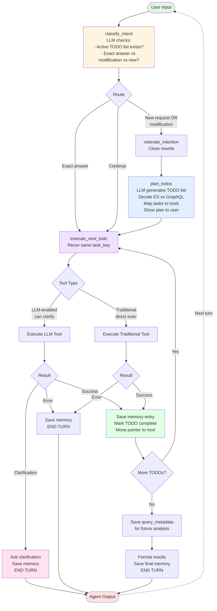

# BI Agent Architecture

## Overview

This agent implements a **TODO-based cyclic execution model** where complex user requests are broken into smaller tasks and executed one at a time, with natural pause points for clarification.

### Core Design Principles

1. **Cyclic Flow**: Every turn starts with `classify_intent` checking TODO list validity
2. **TODO-based Planning**: Complex requests broken into executable tasks with tools
3. **Conversation Turn = 1 TODO Execution**: Each TODO execution is one conversation memory entry
4. **LLM-enabled Tools Can Clarify**: Tools with LLM can ask for clarification mid-execution
5. **Natural Interruption**: User can abort, modify, or continue TODO list at any clarification point
6. **Memory Per TODO**: Each TODO completion saves one memory entry
7. **Query Metadata Caching**: Query structure + retrieval method cached for future analysis

---

## Agent Flow



---

## Flow Explanation

### 1. classify_intent

**Responsibility**: Determine if user input is continuation, exact answer, modification, or new request

**Logic**:
```
Check: active_todo_list exists in state?
Check: clarification_asked exists in previous turn?

If both true:
  LLM analyzes user input:
  - "Shanghai" → exact_answer (rerun current TODO)
  - "Shanghai, and also last week" → modification (ditch TODO list, replan)
  - "forget it, show me X instead" → new_request (ditch TODO list, new plan)

If only active_todo_list true:
  - User says "continue" → continue_current
  - New request → new_request

If no active_todo_list:
  → new_request
```

**Route Decisions**:
- `new_request` or `modification` → `reiterate_intention`
- `exact_answer` → `execute_next_todo` (rerun same task_key)
- `continue` → `execute_next_todo` (next task_key)

---

### 2. reiterate_intention

**Responsibility**: Clean rewrite of user question for clarity

**Inputs**: Raw user input + short-term memory context

**Outputs**: `rewritten_question` (clear, unambiguous version)

**Example**:
- Input: "show me all shipments arrive at port of Miami last week"
- Output: "Retrieve all shipments that arrived at Miami port between 2025-01-08 and 2025-01-15"

---

### 3. plan_todos

**Responsibility**: Generate TODO list with tool mappings

**Strategic + Tactical Planning** (combined in one node for simplicity):

1. **Decide data source**: Single entity → GraphQL, Multiple/aggregation → Elasticsearch
2. **Break into tasks**: Entity resolution → field mapping → query building → execution → summarization
3. **Map tools to tasks**: Each TODO specifies which tool to call
4. **Show plan to user**: Display TODO list before execution

**Example Output**:
```python
{
  "tasks": {
    "resolve_entities": {
      "description": "Resolve 'Miami' and 'last week'",
      "tool": "entity_resolution",
      "can_clarify": True,
      "status": "pending"
    },
    "map_fields": {
      "description": "Map to ES schema fields",
      "tool": "field_mapping",
      "can_clarify": True,
      "status": "pending"
    },
    "build_es_query": {
      "description": "Create ES query",
      "tool": "query_builder",
      "can_clarify": True,
      "status": "pending"
    },
    "execute_es": {
      "description": "Run ES query",
      "tool": "es_executor",
      "can_clarify": False,
      "status": "pending"
    },
    "summarize": {
      "description": "Format results",
      "tool": "llm_summary",
      "can_clarify": False,
      "status": "pending"
    }
  },
  "current_task_key": "resolve_entities",
  "original_request": "show me all shipments...",
  "rewritten_request": "Retrieve all shipments..."
}
```

---

### 4. execute_next_todo

**Responsibility**: Execute the tool for current TODO

**Flow**:
1. Get current TODO by `current_task_key`
2. Check tool type (LLM-enabled vs traditional)
3. Call tool with appropriate params
4. Handle result:
   - Success → Save memory, mark complete, move pointer
   - Clarification → Save memory, END TURN
   - Error → Save memory, END TURN

**Pointer Management**:
- **Rerun**: Keep `current_task_key` same (after clarification answer)
- **Next**: Update `current_task_key` to next task in dict (after success)

**Memory Entry Structure**:
```python
{
  "turn_id": 5,
  "todo_key": "resolve_entities",
  "todo_description": "Resolve 'Miami' and 'last week'",
  "status": "complete",  # or "clarification_needed" or "error"
  "user_input": "Shanghai",
  "agent_action": "Resolved Miami to MIAMI PORT, last week to date range",
  "tools_called": ["entity_resolution"],
  "queries_executed": [],
  "query_metadata": {},
  "clarification_asked": None,
  "active_todo_list_snapshot": {...}
}
```

---

### 5. Available Tools

| Tool Name | Type | Description |
|-----------|------|-------------|
| `llm_tool` | Core | LLM completion and structured output |
| `embedding_tool` | Core | Generate text embeddings |
| `vectordb_tool` | Core | Vector similarity search |
| `entity_resolution` | LLM-enabled | Resolve business entity names to canonical forms |
| `field_mapping` | LLM-enabled | Map business terms to database schema fields |
| `query_builder` | LLM-enabled | Construct Elasticsearch or GraphQL queries |
| `es_executor` | Traditional | Execute Elasticsearch queries |
| `graphql_executor` | Traditional | Execute GraphQL queries |
| `stats_analysis` | Analysis (future) | Statistical analysis on query results |
| `pattern_recognition` | Analysis (future) | Detect patterns in data |

**Tool Types**:
- **LLM-enabled**: Can ask clarification questions (configurable via `can_clarify` flag)
- **Traditional**: Direct execution, no clarification capability
- **Core**: Foundational tools used by other tools

---

### 6. Query Metadata for Analysis

After query execution completes, metadata is saved for future data analysis:

```python
{
  "query_metadata": {
    "query_type": "elasticsearch",
    "query": {...},  # Full query structure
    "summary": "142 shipments found",
    "how_to_retrieve": "ES shipments index, filters: port_name=Miami, arrival_date=...",
    "executed_at": "2025-01-15T10:30:00"
  }
}
```

When user later says "analyze delay patterns in these results", the agent can:
1. Retrieve query_metadata from previous turn
2. Re-execute query or use cached results
3. Pass to analysis tools

---

## Data Models

### State Models

#### BIAgentState
```python
class BIAgentState(TypedDict):
    messages: Annotated[list, add_messages]  # LangGraph message history
    current_turn_id: int
    user_input: str

    # Phase-specific contexts
    intent: IntentContext
    resolution: ResolutionContext
    query: QueryContext
    execution: ExecutionContext

    memory: Any  # ShortTermMemory reference
    current_phase: Literal["intent", "reiteration", "resolution", ...]
    iteration_count: int
    error: str | None
    agent_response: str | None
```

#### IntentContext
```python
class IntentContext(TypedDict):
    intent_type: Literal["data_retrieval", "analysis", "continuation", "edit_query", "clarification"]
    data_retrieval_type: Literal["single_entity", "multi_entity", "aggregation"] | None
    confidence: float
    entities: dict[str, list[str]]  # {"vessel": ["MSC ANNA"]}
    aggregation_keywords: list[str]  # ["latest", "average", "most"]
    time_range: dict | None
    requires_clarification: list[str]
    rewritten_question: str | None
```

#### ResolutionContext
```python
class ResolutionContext(TypedDict):
    unresolved_entities: dict[str, list[str]]
    resolved_entities: dict[str, list[dict]]  # {"vessel": [{"name": "MSC ANNA", "id": "..."}]}
    ambiguous_entities: dict[str, list[dict]]
    field_mappings: dict[str, dict]  # Maps entities to DB fields
    resolution_metadata: dict
```

#### QueryContext
```python
class QueryContext(TypedDict):
    query_mode: Literal["create_new", "edit_existing"]
    query_type: Literal["elasticsearch", "graphql", "hybrid"]
    es_query: dict | None
    graphql_query: str | None
    previous_query: dict | None
    query_plan: dict
    validation_errors: list[str]
    needs_approval: bool
    user_approved: bool | None
```

#### ExecutionContext
```python
class ExecutionContext(TypedDict):
    raw_results: dict
    record_count: int
    execution_time_ms: float
    data_sources_used: list[str]
    query_metadata: dict  # For analysis forwarding
```

### Memory Models

#### ConversationTurn
```python
class ConversationTurn(BaseModel):
    turn_id: int
    user_message: Message
    agent_response: Message

    intent_detected: str
    rewritten_question: str | None
    entities_extracted: dict
    queries_executed: list[dict]
    query_metadata: dict  # {query_type, query, summary, how_to_retrieve}

    started_at: datetime
    completed_at: datetime
    tokens_used: int
```

#### Message
```python
class Message(BaseModel):
    role: Literal["user", "assistant", "system"]
    content: str
    timestamp: datetime
    metadata: dict
```

---

## Key Scenarios

### Scenario 1: Simple Query (No Clarification)

```
Turn 1:
User: "Show shipments to Miami last week"
  → classify_intent (new_request)
  → reiterate_intention ("Retrieve shipments to Miami port 2025-01-08 to 2025-01-15")
  → plan_todos (5 tasks: resolve, map, build, execute, summarize)
  → execute_next_todo (resolve_entities) ✓
  → save memory (turn_id=1, todo_key="resolve_entities")
  → execute_next_todo (map_fields) ✓
  → save memory (turn_id=2, todo_key="map_fields")
  → execute_next_todo (build_es_query) ✓
  → save memory (turn_id=3, todo_key="build_es_query")
  → execute_next_todo (execute_es) ✓
  → save memory (turn_id=4, todo_key="execute_es")
  → execute_next_todo (summarize) ✓
  → save memory (turn_id=5, todo_key="summarize")
  → save_query_metadata
  → format_results
  → END TURN

Result: 5 memory entries saved
```

### Scenario 2: Clarification Needed

```
Turn 1:
User: "Show shipments to Miami last week"
  → classify_intent (new_request)
  → reiterate_intention
  → plan_todos (5 tasks)
  → execute_next_todo (resolve_entities)
    → entity_resolution tool says: "Not sure which Miami - Port of Miami or Miami Container Terminal?"
  → save memory (turn_id=1, status="clarification_needed")
  → ask_clarification
  → END TURN

Agent shows: "Which Miami: Port of Miami or Miami Container Terminal?"

Turn 2:
User: "Port of Miami"
  → classify_intent (exact_answer detected, active_todo_list valid)
  → execute_next_todo (rerun resolve_entities with answer) ✓
  → save memory (turn_id=2, todo_key="resolve_entities", status="complete")
  → execute_next_todo (map_fields) ✓
  → ... (continues as Scenario 1)
```

### Scenario 3: User Modifies Mid-Clarification

```
Turn 1:
User: "Show shipments to Miami last week"
  → ... (same as Scenario 2)
  → Asks: "Which Miami: Port of Miami or Miami Container Terminal?"
  → END TURN

Turn 2:
User: "Port of Miami, but also include arrival date"
  → classify_intent (modification detected: new entity "arrival date")
  → Ditch old TODO list
  → reiterate_intention (new: "Retrieve shipments to Port of Miami with arrival dates, last week")
  → plan_todos (new TODO list with date field mapping)
  → execute_next_todo (starts fresh)
```

### Scenario 4: User Aborts

```
Turn 1:
User: "Show shipments to Miami last week"
  → ... asks clarification
  → END TURN

Turn 2:
User: "forget it, show me container status instead"
  → classify_intent (new_request detected)
  → Ditch old TODO list
  → reiterate_intention ("Retrieve container status")
  → plan_todos (completely new TODO list)
  → execute_next_todo
```

### Scenario 5: Data Analysis After Query

```
Turn 1-5: (User completes shipment query, 5 memory entries saved)
Agent returns: "Found 142 shipments to Miami port..."
query_metadata saved: {query_type: "elasticsearch", query: {...}}

Turn 6:
User: "analyze delay patterns in these results"
  → classify_intent (checks: previous turn has query_metadata → can be continuation or new request)
  → LLM decides: continuation (references previous results)
  → plan_todos generates analysis TODOs:
    [
      "retrieve_query_metadata",
      "run_statistical_analysis",
      "identify_delay_patterns",
      "generate_insights"
    ]
  → execute_next_todo (retrieve_query_metadata from turn 5)
  → execute_next_todo (run_statistical_analysis)
  → ...
```

---

## Extension Points

### Adding Data Analysis Capability

To support data analysis, simply teach `plan_todos` to generate analysis TODOs:

```python
# plan_todos LLM prompt includes:
"If user asks for data analysis:
  - Check if previous turn has query_metadata
  - Generate TODOs: retrieve_query_metadata, run_analysis_tool, generate_insights
  - Map to tools: stats_analysis, pattern_recognition, visualization_generator"
```

Register new tools:
```python
registry.register(StatisticalAnalysisTool())
registry.register(PatternRecognitionTool())
registry.register(VisualizationTool())
```

No new nodes needed - `execute_next_todo` handles all tool execution.

### Adding New Capabilities

1. **Register new tools** in tool registry
2. **Update plan_todos LLM prompt** to know when to use new tools
3. **Optionally add new routing logic** if complex branching needed

The cyclic flow handles everything else automatically.

---

## Memory Hierarchy

```
1. Within-Turn State (BIAgentState)
   - Active TODO list
   - Current task execution
   - Temporary results
   ↓

2. Short-Term Memory (last N conversation turns)
   - Each TODO completion = 1 turn
   - Injected as context for classify_intent
   ↓

3. Long-Term Memory (future - all turns in vector DB)
   - Semantic search over conversation history
   - Retrieve relevant past queries for analysis
```

---

## Design Decisions

1. **TODO-based Execution**: Transparent progress, natural pause points, user can interrupt/modify at any point
2. **Cyclic Flow**: Every turn starts from `classify_intent` for clean resumption after clarification
3. **LLM-enabled Tools**: Can ask clarification when ambiguous (entity resolution, field mapping, query building)
4. **Memory Per TODO**: 1 entry per TODO completion for detailed conversation history
5. **Combined Planning**: Strategic + tactical planning in `plan_todos` for simplicity

---

## Next Steps

1. **Implement Core Nodes**: `classify_intent`, `reiterate_intention`, `plan_todos`, `execute_next_todo`
2. **Implement Tools**: Entity resolution, field mapping, query builders, executors
3. **Define Prompts**: LLM prompts for each node in `config/prompts.yaml`
4. **Test Scenarios**: Walk through all 5 scenarios above
5. **Add Data Analysis**: Register analysis tools, update `plan_todos` prompt

---

## Folder Structure

```
my_cbp_agent/
├── config/
│   ├── settings.py              # Settings (loads .env)
│   └── prompts.yaml             # LLM prompts
│
├── domain/
│   ├── state.py                 # BIAgentState, context TypedDicts
│   ├── conversation.py          # ConversationTurn, Message
│   ├── memory.py                # ShortTermMemory, LongTermMemory
│   ├── entities.py              # Entity domain objects
│   └── query.py                 # Query domain objects
│
├── services/
│   ├── llm_service.py           # LLM abstraction
│   ├── embedding_service.py     # Embedding abstraction
│   └── vectordb_service.py      # Vector DB abstraction
│
├── tools/
│   ├── base.py                  # BaseTool, ToolResult
│   ├── registry.py              # ToolRegistry
│   ├── adapters/                # Local & MCP adapters
│   ├── llm/                     # LLM tool
│   ├── embedding/               # Embedding tool
│   ├── vector/                  # Vector search, field mapping
│   ├── data_sources/            # ES & GraphQL executors
│   └── query_builders/          # ES & GraphQL query builders
│
├── nodes/                       # (To be refactored to new flow)
│   ├── intent/                  # classify_intent, reiterate_intention
│   ├── resolution/              # entity_resolver, field_mapping
│   ├── query/                   # query_planner, query_builder
│   ├── execution/               # executor_node
│   └── response/                # formatter, generator
│
├── routing/
│   ├── route_intent.py          # Intent routing logic
│   └── ...                      # Other routers
│
├── memory/
│   ├── manager.py               # MemoryManager
│   ├── short_term.py            # ShortTermMemory
│   └── checkpointer.py          # LangGraph checkpointer
│
├── mcp_server/                  # MCP exposure (future)
│   └── server.py
│
├── graph.py                     # LangGraph assembly
├── agent.py                     # Main entry point
└── tests/
```

**Note**: Current `nodes/` structure represents OLD architecture. New flow will require refactoring to simplified nodes (`classify_intent.py`, `reiterate_intention.py`, `plan_todos.py`, `execute_next_todo.py`, `generate_response.py`).

---

